# Lab 1 — Minimal HTTP Server: Verification Report


## 1. Bringing the stack up (environment + startup)
- Command used to build and start containers:

```
docker compose up --build
```

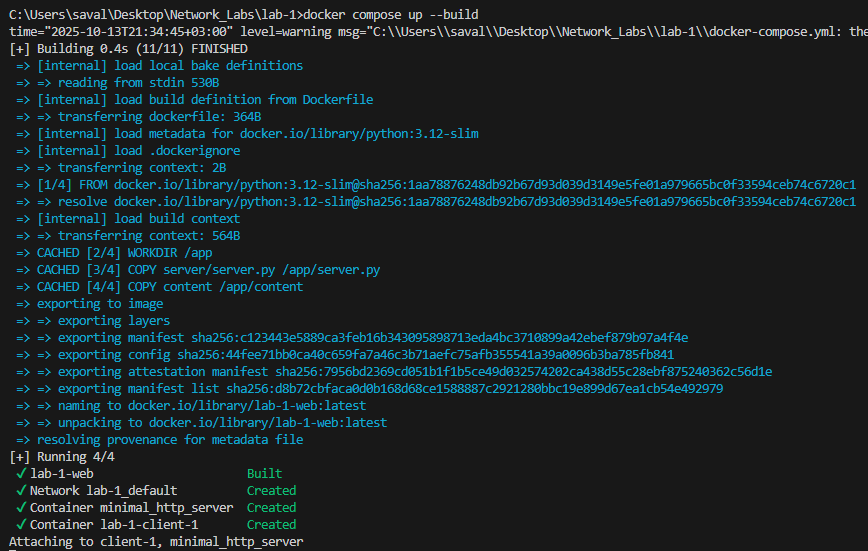

Notes:
- Run from the `lab-1` directory.
- The `web` service exposes port 8080 to the host.

---

## 2. What’s being served (directory overview)
- Root directory passed to the server: `content/`
- Contents include HTML, a PNG image, one or more PDFs, and a nested subdirectory for deeper navigation.

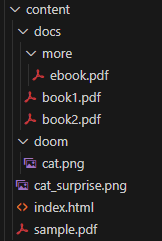

Short note: This satisfies the requirement for HTML/PNG/PDF files and a nested directory.

---

## 3. Landing page and root listing
- Open the service in a browser:

```
http://localhost:8080/
```

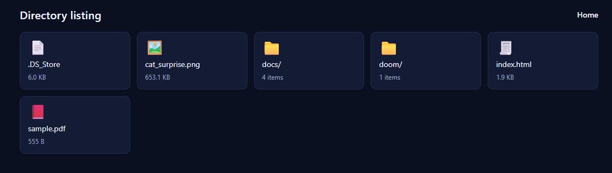

---

## 4. Static HTML with image reference
- Request the HTML page that references an image:

```
http://localhost:8080/index.html
```


---

## 5. Navigating into a subfolder (nested listing)
- Example nested path:

```
http://localhost:8080/books/
```

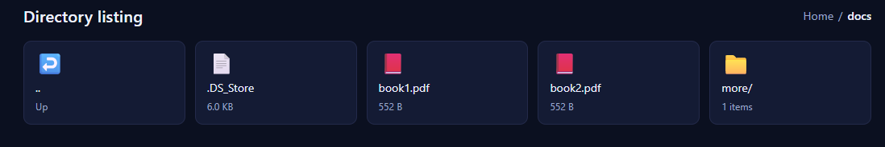
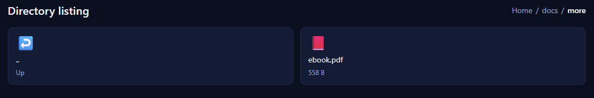

---

## 6. Downloading a PDF
- Use the directory listing link or request directly:

```
http://localhost:8080/books/CSlab1.pdf
```

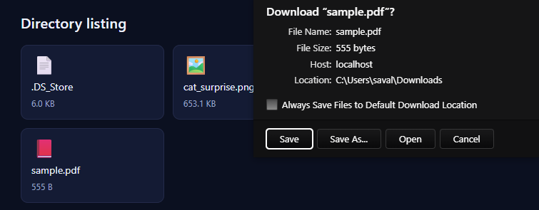

---

## 7. Client program runs (HTML, PDF, directory)
The included client takes four arguments: `server_host server_port filename directory`.

1) Fetch HTML and print to console

```
python client\client.py localhost 8080 index.html .
```

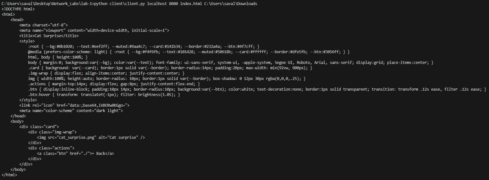

2) Download a PDF into the current folder

```
python client\client.py localhost 8080 books\CSlab2.pdf .
```

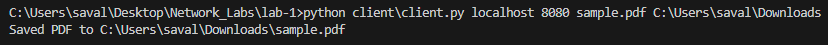


3) Fetch a directory listing (prints HTML)

```
python client\client.py localhost 8080 books\ .
```

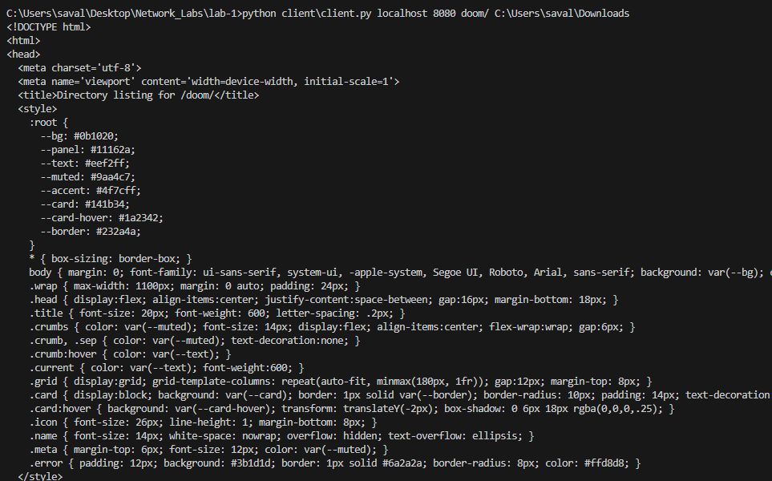

---

## 8. Testing across the LAN (optional)
- From another device on the same network (replace with your LAN IP):

```
python client\client.py 192.168.18.5 8080 index.html .
```

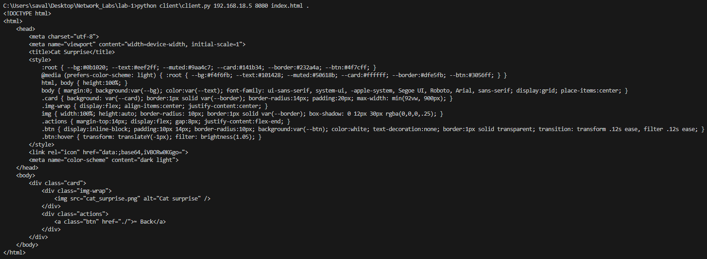

---

## 9. Error behavior example (404)
- Browser example (unsupported/missing):

```
http://localhost:8080/happiness
```

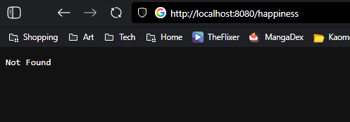

- Client example:

```
python client\client.py localhost 8080 happiness/ .
```

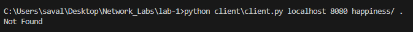

---

## 10. Compliance checklist
- Docker + Compose workflow: Implemented
- Single‑request TCP HTTP server: Implemented
- File types: HTML, PNG, PDF are served
- 404 handling: Missing/unsupported files return 404
- Directory listing: Implemented, supports nested folders
- Subdirectory with PDFs/PNG: Present (e.g., `books/`)
- Client CLI: `client.py host port filename directory` prints HTML, saves PNG/PDF
- Image reference in HTML: Present in `index.html`
- Bonus (LAN browsing): Possible; steps provided

---

## 11. Stopping and cleanup
- Graceful stop of containers:

```
docker compose down
```

Or stop with Ctrl+C if running in the foreground.

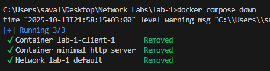

---

## 12. Notes and small design choices
- Only required extensions are served; others return 404 for clarity.
- Path traversal is blocked by a normalized path prefix check.
- Uses only Python standard library (`os`, `sys`, `socket`).

