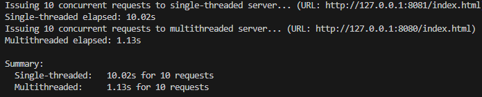
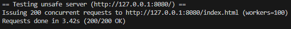
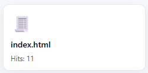
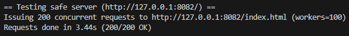
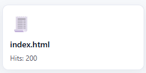
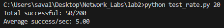
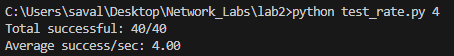

# Lab 2 — Concurrent HTTP Server


Services (docker-compose, `lab2/`):
- `multi_unsafe` — multithreaded, naive counter (race) on http://127.0.0.1:8080
- `single`       — single-threaded server on http://127.0.0.1:8081
- `multi_safe`   — multithreaded, locked counter on http://127.0.0.1:8082
- `rate`         — rate-limited server (per-IP) on http://127.0.0.1:8083

Start services (from `lab2/`):

```cmd
cd C:\Users\saval\Desktop\Network_Labs\lab2
docker-compose up --build
```

---

## 1) Performance comparison — 10 concurrent requests

Command used (issues 10 concurrent requests and prints elapsed time for both servers):

```cmd
python C:\Users\saval\Desktop\Network_Labs\lab2\test_concurrency.py --single-url http://127.0.0.1:8081/index.html --multi-url http://127.0.0.1:8082/index.html
```





---

## 2) Hit counter and race condition

How to trigger the race (naive counter on port 8080):

1. Ensure `multi_unsafe` is running (port 8080).
2. Run the race tester (200 concurrent requests):

```cmd
python C:\Users\saval\Desktop\Network_Labs\lab2\test_counter_race.py --requests 200 --workers 100
```


- Race run (requests sent):

  

- Directory listing showing hits after naive run (example shows only 11 hits recorded):

  

Code responsible for the race:

```py
# naive non-atomic update (race-prone)
cur = COUNTS.get(key, 0)
time.sleep(0.01)  # increase chance of interleaving
COUNTS[key] = cur + 1
```

Fixed code:

```py
with COUNTS_LOCK:
    COUNTS[key] = COUNTS.get(key, 0) + 1
```

Re-run the tester against `multi_safe` (port 8082) and verify:

- Race run (requests sent):

  

- Directory listing after fixed run (shows 200 hits):

  

---

## 3) Rate limiting (per-IP)

How to spam (example 20 req/s for 10s):

```cmd
python C:\Users\saval\Desktop\Network_Labs\lab2\test_rate.py 20
```




Caption: 20 req/s for 10s produced only 50 accepted requests out of 200 (≈5 req/s enforced).

How to test a lower rate (4 req/s for 10s):

```cmd
python C:\Users\saval\Desktop\Network_Labs\lab2\test_rate.py 4
```



Caption: 4 req/s for 10s produced 40/40 accepted (≈4 req/s), showing the limiter allows up to the configured rate.

To demonstrate that limits apply per source IP, run the spammer from one host/container and run the same spammer from a different host/container — each source IP is tracked separately and will be limited independently.


1. Start the services with docker-compose (on the host):

```cmd
cd C:\Users\saval\Desktop\Network_Labs\lab2
docker-compose up --build
```

2. From your host run the spammer against the rate service (this will be "source A"):

```cmd
python C:\Users\saval\Desktop\Network_Labs\lab2\test_rate.py 20
```

3. From a different machine or from another container (source B) run the same command pointed at the same service — the second source should still be able to obtain up to the configured per-IP rate (they are limited independently). Example of running a client inside a container on Windows (reach host via host.docker.internal):

```bash
docker run --rm -v C:/Users/saval/Desktop/Network_Labs/lab2:/work -w /work python:3.11-slim \
  python test_rate.py 20 http://host.docker.internal:8083/index.html
```

What to expect / how the server handles multiple IPs

- The server keeps a mapping (`REQUEST_TIMES`) keyed by the client IP. Each IP maps to its own deque of recent request timestamps. When a request arrives the server:
  1. determines the client IP (uses the socket address by default),
  2. removes timestamps older than 1 second from that IP's deque,
  3. checks whether the length of the deque is below the configured per-IP limit, and
  4. either appends the current timestamp and allows the request or returns 429 if the IP has exhausted its quota.

- Because the data structure is keyed by IP, different IPs do not share the same quota — each IP gets its own sliding 1s window and can reach up to the configured RPS independently.

- Server debug logs: when an IP is rate-limited the server emits a short debug line. Example when two sources are active:

```text
[rate] 192.168.1.12 -> 429 (over 5/s)
[rate] 172.17.0.3 -> 429 (over 5/s)
```

- Example expected outcome (R=5 for 10s): if you run two independent clients concurrently, you should see roughly 50 accepted requests per client over 10 seconds (subject to timing jitter). `test_rate.py` prints a summary like:

```text
Total successful: 50/200
Average success/sec: 5.00
```

Notes and limitations

- Use distinct hosts or containers to create distinct source IPs. If you run both spammers from the same host without additional networking configuration, they will share the same source IP and therefore the same rate budget.
- The rate state (`REQUEST_TIMES`) and hit counters are in-memory and ephemeral — restarting the server clears them.
- The README previously showed an X-Forwarded-For simulation; that method has been removed from this section to keep the instructions focused on real, distinct sources. If you later want a quick header-based simulation we can add a separate testing snippet.

---

## Commands summary

- How to send 10 requests to the single-threaded server:

  ```cmd
  python C:\Users\saval\Desktop\Network_Labs\lab2\test_concurrency.py --single-url http://127.0.0.1:8081/index.html --multi-url http://127.0.0.1:8082/index.html
  ```

- How to send 10 requests to the multi-threaded server: same command as above (the script reports both).

- How to trigger a race condition: run `test_counter_race.py --requests 200 --workers 100` against `multi_unsafe` (port 8080).

- Code responsible for it (max. 4 lines):

```py
cur = COUNTS.get(key, 0)
time.sleep(0.01)
COUNTS[key] = cur + 1
```

- Fixed code:

```py
with COUNTS_LOCK:
    COUNTS[key] = COUNTS.get(key, 0) + 1
```

