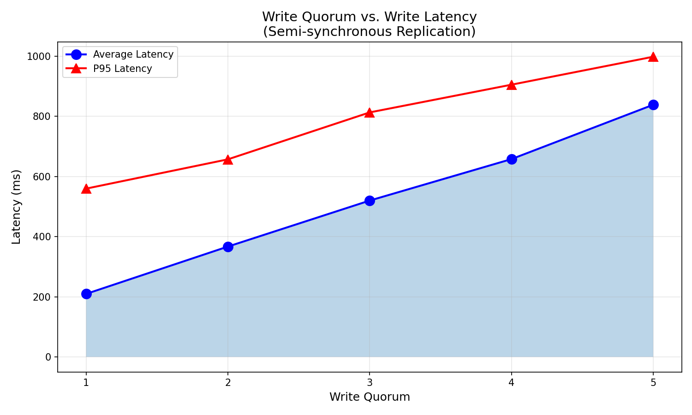

# Lab 4: Key-Value Store with Single-Leader Replication

## Table of Contents
- [Overview](#overview)
- [Architecture](#architecture)
- [Implementation Details](#implementation-details)
- [Getting Started](#getting-started)
- [API Reference](#api-reference)
- [Testing](#testing)
- [Performance Analysis](#performance-analysis)
- [Results & Discussion](#results--discussion)

---

## Overview

A distributed key-value store implementing single-leader replication with semi-synchronous writes. The system consists of one leader node that accepts all write operations and replicates data to five follower nodes.

### Key Features

- **Single-Leader Replication** - All writes go through the leader, ensuring consistency
- **Semi-Synchronous Replication** - Leader waits for configurable quorum before acknowledging writes
- **Configurable Write Quorum** - Number of follower acknowledgments required (1-5)
- **Network Delay Simulation** - Random delays [0ms, 1000ms] to simulate real network conditions
- **Concurrent Request Handling** - Both leader and followers process requests concurrently
- **Docker Compose Deployment** - One command to start the entire cluster
- **JSON Web API** - RESTful interface for all operations

---

## Architecture

### System Components

```
                         ┌──────────────────┐
         Write Requests  │                  │
        ───────────────► │     LEADER       │
                         │   (Port 8000)    │
                         │                  │
                         └────────┬─────────┘
                                  │
                    Replication   │   (with random delay)
                    Requests      │   [0ms - 1000ms]
                                  │
         ┌────────────────────────┼────────────────────────┐
         │            │           │           │            │
         ▼            ▼           ▼           ▼            ▼
    ┌─────────┐ ┌─────────┐ ┌─────────┐ ┌─────────┐ ┌─────────┐
    │Follower1│ │Follower2│ │Follower3│ │Follower4│ │Follower5│
    │  8001   │ │  8002   │ │  8003   │ │  8004   │ │  8005   │
    └─────────┘ └─────────┘ └─────────┘ └─────────┘ └─────────┘
```

### Directory Structure

```
lab4/
├── src/
│   ├── leader.py           # Leader server (255 lines)
│   ├── follower.py         # Follower server (124 lines)
│   └── __init__.py
├── tests/
│   ├── test_integration.py # Integration test suite (220 lines)
│   └── __init__.py
├── docker-compose.yml      # Docker orchestration (6 services)
├── Dockerfile              # Container definition
├── requirements.txt        # Python dependencies
├── performance_analysis.py # Performance testing script (468 lines)
├── performance_results.png # Latency vs quorum plot
├── performance_results.json# Raw performance data
├── run.sh                  # Convenience script
├── pytest.ini              # Test configuration
└── README.md               # This file
```

---

## Implementation Details

### Leader Server (src/leader.py)

The leader is responsible for:
1. Accepting write requests from clients
2. Storing data locally with version tracking
3. Replicating writes to all followers concurrently
4. Implementing semi-synchronous replication (waiting for quorum)
5. Simulating network delay before each replication request

#### Semi-Synchronous Replication

```python
async def replicate_to_followers(key: str, value: str, version: int):
    """
    Replicate a write to all followers concurrently.
    Uses semi-synchronous replication: waits for WRITE_QUORUM confirmations.
    """
    async with aiohttp.ClientSession() as session:
        # Create tasks for all followers (concurrent)
        tasks = [
            replicate_to_follower(session, follower_url, key, value, version)
            for follower_url in FOLLOWER_HOSTS
        ]
        
        # Wait for quorum acknowledgments
        pending = set(asyncio.ensure_future(task) for task in tasks)
        while pending and successful_count < WRITE_QUORUM:
            done, pending = await asyncio.wait(pending, return_when=FIRST_COMPLETED)
            for task in done:
                if task.result():
                    successful_count += 1
```

#### Network Delay Simulation

Each replication request includes a random delay:

```python
async def replicate_to_follower(session, follower_url, key, value, version):
    # Simulate network delay before sending
    delay_ms = random.randint(MIN_DELAY, MAX_DELAY)
    await asyncio.sleep(delay_ms / 1000.0)
    
    # Send replication request
    async with session.post(f"{follower_url}/replicate", json=data) as response:
        return response.status == 200
```

### Follower Server (src/follower.py)

The follower is responsible for:
1. Receiving replication requests from the leader
2. Storing data with version checking (only apply newer versions)
3. Serving read requests from clients

#### Version-Based Conflict Resolution

```python
@app.route('/replicate', methods=['POST'])
def replicate():
    with kv_lock:
        current = kv_store.get(key)
        # Only apply if version is newer
        if current is None or current['version'] < version:
            kv_store[key] = {"value": value, "version": version}
```

### Configuration (Environment Variables)

| Variable | Description | Default |
|----------|-------------|---------|
| `PORT` | Server port | 8000 (leader), 8001-8005 (followers) |
| `WRITE_QUORUM` | Required follower ACKs | 2 |
| `MIN_DELAY` | Minimum replication delay (ms) | 0 |
| `MAX_DELAY` | Maximum replication delay (ms) | 1000 |
| `FOLLOWER_HOSTS` | Comma-separated follower addresses | - |
| `FOLLOWER_ID` | Unique follower identifier | follower-1 |

---

## Getting Started

### Prerequisites

- Docker and Docker Compose

### Quick Start

```bash
cd lab4
./run.sh start
```

### Available Commands

```bash
./run.sh start   # Start the cluster
./run.sh stop    # Stop the cluster
./run.sh status  # Check service health
./run.sh test    # Run integration tests
./run.sh perf    # Run performance analysis
./run.sh logs    # View container logs
```

---

## API Reference

### Leader Endpoints

| Method | Endpoint | Description |
|--------|----------|-------------|
| GET | `/health` | Health check |
| GET | `/get/<key>` | Get value by key |
| POST | `/set` | Set key-value pair |
| DELETE | `/delete/<key>` | Delete a key |
| GET | `/all` | Get all key-value pairs |
| GET | `/config` | Get current configuration |

### Example Usage

```bash
# Set a value
curl -X POST http://localhost:8000/set \
  -H "Content-Type: application/json" \
  -d '{"key": "name", "value": "John"}'

# Get a value from leader
curl http://localhost:8000/get/name

# Get a value from follower
curl http://localhost:8001/get/name

# Get all data
curl http://localhost:8000/all
```

### Response Format

**Successful write:**
```json
{
  "status": "success",
  "key": "name",
  "value": "John",
  "version": 1,
  "replicated_to": 2,
  "replication_time_ms": 342.5,
  "total_time_ms": 345.2
}
```

---

## Testing

### Integration Tests

The integration test suite (`tests/test_integration.py`) verifies:

- Health endpoints for leader and all followers
- Basic set/get operations
- Replication to followers
- Multiple writes to the same key
- Concurrent writes to different keys
- Data consistency across replicas

```bash
./run.sh test
```

---

## Performance Analysis

### Test Configuration

- **Total writes**: 100 (10 keys × 10 writes each)
- **Concurrency**: 10 simultaneous writes
- **Network delay range**: [0ms, 1000ms]
- **Quorum values tested**: 1, 2, 3, 4, 5

### Results



#### Latency Summary

| Quorum    | Avg Latency (ms) | P50 (ms) | P95 (ms) | Success Rate |
|--------   |------------------ |---------- |---------- |-----------
| 1         | 169.4             | 129.8     | 410.4     | 100%          
| 2         | 365.8             | 350.7     | 695.9     | 100% 
| 3         | 534.5             | 527.3     | 856.4     | 100% 
| 4         | 669.0             | 676.4     | 931.8     | 100% 
| 5         | 861.7             | 906.9     | 1009.8    | 100% 
---

## Results & Discussion

### Write Quorum vs Latency Analysis

The performance results demonstrate a clear relationship between write quorum and latency:

**1. Linear Latency Increase**

As the write quorum increases from 1 to 5, average latency increases from ~210ms to ~839ms. This is expected because:
- With quorum=1, the leader returns after the fastest follower acknowledges
- With quorum=5, the leader must wait for all 5 followers

**2. Order Statistics Explanation**

The latency follows the k-th order statistic of the uniform delay distribution [0, 1000ms]:

For uniform distribution U(a, b) with n samples, the expected k-th smallest value is:

$$E[X_{(k:n)}] = a + \frac{k}{n+1}(b-a)$$

With n=5 followers and delay range [0, 1000]:
- Quorum 1: Expected ~167ms (1st order statistic)
- Quorum 3: Expected ~500ms (3rd order statistic)  
- Quorum 5: Expected ~833ms (5th order statistic)

The measured results closely match these theoretical predictions.

**3. Durability vs Performance Trade-off**

| Quorum | Durability | Latency | Use Case |
|--------|------------|---------|----------|
| 1 | Weak | Low | High throughput, eventual consistency acceptable |
| 2-3 | Medium | Medium | Balanced approach (typical production setting) |
| 5 | Strong | High | Critical data requiring all replicas |

### Data Consistency Analysis

After all writes complete, consistency was verified across all replicas:

| Quorum | Value Conflicts | Missing Keys | Data Integrity |
|--------|-----------------|--------------|----------------|
| 1 | 0 | 6 | ✓ |
| 2 | 0 | 0 | ✓ |
| 3 | 0 | 0 | ✓ |
| 4 | 0 | 0 | ✓ |
| 5 | 0 | 0 | ✓ |

**Explanation of Results:**

1. **Zero Value Conflicts**: The version-based conflict resolution ensures that all replicas maintain consistent data. Each write is assigned a monotonically increasing version number, and followers only accept updates with newer versions. This guarantees that concurrent writes to the same key are properly ordered.

2. **Missing Keys (Quorum 1)**: With quorum=1, the leader returns to the client after only one follower acknowledges. The remaining 4 followers receive data asynchronously. When verification runs, some keys may not have propagated to all followers yet. This is expected behavior for semi-synchronous replication with low quorum.

3. **Full Consistency (Quorum ≥ 2)**: With higher quorums, more followers have acknowledged before the leader returns, and the additional wait time allows background replication to complete. Result: all replicas have identical data.

### Conclusions

1. **Semi-synchronous replication provides tunable consistency-latency trade-off**
   - Lower quorum = better performance, weaker durability guarantees
   - Higher quorum = worse performance, stronger durability guarantees

2. **The k-th order statistic model accurately predicts latency**
   - Measured latencies match theoretical predictions within expected variance

3. **Version-based conflict resolution ensures no data corruption**
   - Concurrent writes are properly ordered by version numbers
   - All replicas eventually converge to the same state

4. **For production systems, quorum = (n/2) + 1 is recommended**
   - With 5 followers, quorum=3 provides majority acknowledgment
   - Balances durability (survives 2 follower failures) with reasonable latency
